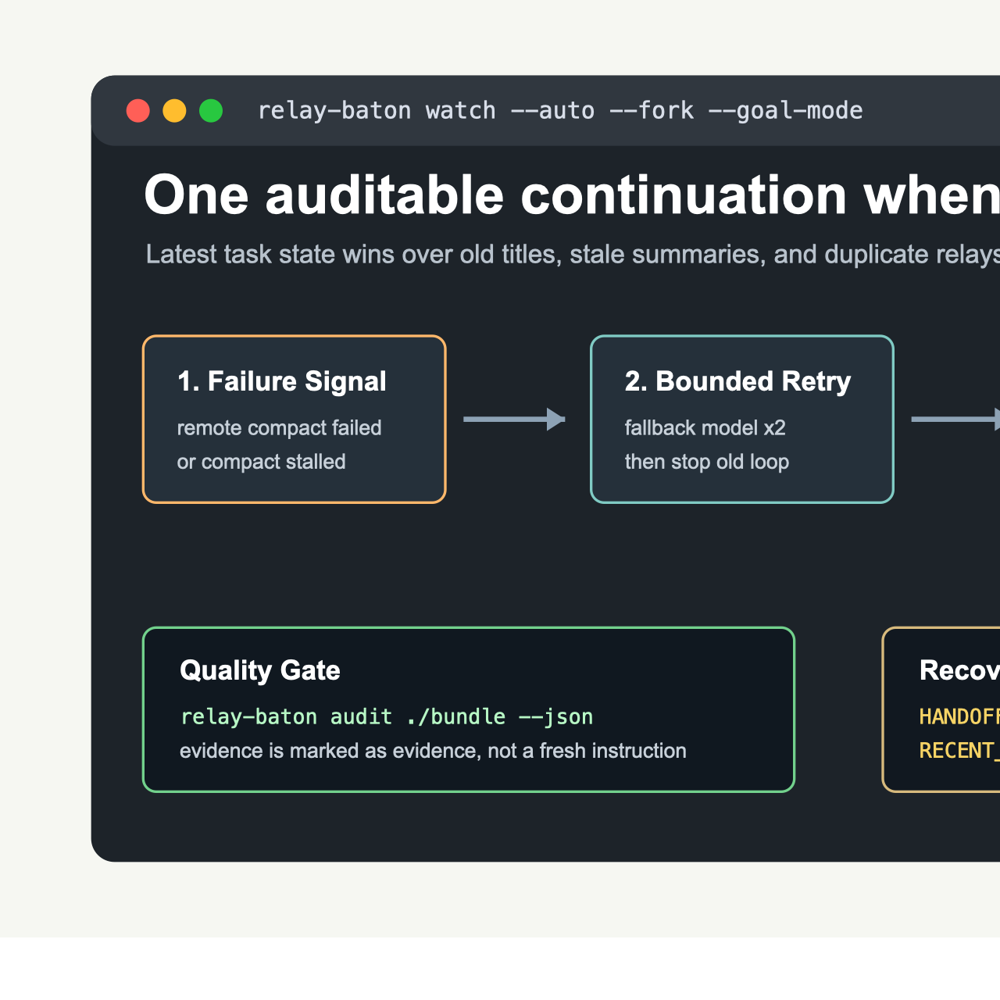

# Relay Baton

[](https://github.com/guorunjie/codex-relay-baton-guardian/actions/workflows/ci.yml)
[](https://github.com/guorunjie/codex-relay-baton-guardian/releases)
[](LICENSE)

**Sleep-safe Codex recovery for long-running tasks.**



Relay Baton keeps long-running Codex work moving while you sleep. When Codex hits remote compaction failures, unsupported compact models, or the hard context-window error `Codex ran out of room in the model's context window`, it detects the stuck source thread, preserves the latest real task state, and starts one safe relay so the work can continue instead of dying overnight.

The core rule is simple: preserve the real latest task state before creating a new visible conversation.

## Why It Exists

Long agent sessions often fail after the project has already changed direction. A naive handoff based on the old thread title or an early summary can revive abandoned work and mislead the next conversation.

Relay Baton avoids that by combining:

- Codex `fork` when the original session is still readable, because fork keeps the original conversation history and workspace state closest to intact.
- Last-healthy-checkpoint fork for hard context overflow, using the newest successful `Stop` or `PostCompact` hook instead of retrying the saturated source thread.
- Fallback-model recovery for model-specific compact failures, tried twice per source thread.
- Structured memory files that prioritize the latest goal, latest real user intent, concrete tool progress, current worktree state, and superseded directions.
- Desktop handoff only when the user asks for a visible new Desktop conversation or when fork/CLI recovery is unavailable.

## Features

- `relay-baton doctor` checks Codex CLI, local SQLite state, logs, configured models, and compact hooks.
- `relay-baton status` summarizes doctor, monitor, activity, and recovery state in one view.
- `relay-baton install-hooks` installs Codex lifecycle hooks for activity tracking and compact snapshots.
- `relay-baton follow install` installs Codex lifecycle hooks and the background monitor together.
- `relay-baton follow repair` repairs hooks, LaunchAgent PATH, and monitor startup after shell or Homebrew path changes.
- `relay-baton watch --auto --fork` monitors Codex logs and runs the recovery ladder automatically.
- `relay-baton recover --thread <id> --strategy auto` executes fallback-model, last-healthy-fork, fork, or new-session recovery.
- `relay-baton audit <bundle>` scores a recovery bundle without creating a fork or Desktop conversation.
- `relay-baton demo` creates an auditable sample recovery bundle for trying the workflow without waiting for a real stuck thread.
- `relay-baton handoff --thread <id> --desktop --goal-mode` creates a Desktop-visible continuation with a quality gate.
- `relay-baton release check` verifies release readiness locally, with optional online GitHub/npm checks and a strict `--v1` evidence gate.
- `relay-baton validate host` writes a shareable host validation report for platform support evidence.
- `relay-baton monitor install` installs a background monitor:
  - macOS: LaunchAgent at `~/Library/LaunchAgents/com.relay-baton.monitor.plist`
  - Linux: systemd user service at `~/.config/systemd/user/relay-baton-monitor.service`
  - Windows: Task Scheduler install script generated under the Relay Baton log directory
- Legacy aliases remain available: `guardian` and `codex-context-guardian`.

## Recovery Bundle

Every fork/new-session/Desktop relay can carry the same bundle:

- `HANDOFF_MEMORY.json`: machine-readable checkpoint with latest goal, latest user intent, latest assistant/tool progress, superseded directions, pending/completed/blockers, next action, telemetry, warnings, confidence, and evidence.
- `RECENT_THREAD_CONTEXT.md`: human-readable recent context. Evidence blocks are clearly marked as source evidence, not fresh instructions.
- `RECOVERY.md`: fixed recovery order and prompt.
- `git-status.txt`, `git-diff-stat.txt`, `git-diff.patch`: current workspace facts.
- `selected-files.md`: capped project files for recovery.

Recovery priority is fixed:

1. `HANDOFF_MEMORY.json`
2. `RECENT_THREAD_CONTEXT.md`
3. Git status/diff and current files
4. Selected project files
5. Old thread title

If those disagree, Relay Baton tells the next session to trust the bundle and current worktree over the old title.

## Codex Following

Relay Baton follows Codex with a hybrid trigger model:

- Lifecycle hooks record near-real-time activity for `SessionStart`, `UserPromptSubmit`, `PreToolUse`, `PostToolUse`, `Stop`, `PreCompact`, and `PostCompact`.
- The background monitor polls Codex's local log database as a safety net.
- `activity-state.json` keeps the latest event, active turn, compact state, healthy checkpoints, and recent hook events for each thread.

This is more reliable than pure polling and less brittle than depending only on private Desktop UI state.

Install the full local follower:

```bash
relay-baton follow install
relay-baton follow start
relay-baton follow status
```

Inspect recorded activity:

```bash
relay-baton activity status
```

Generate and audit a demo bundle:

```bash
relay-baton demo
relay-baton audit ~/.codex/relay-baton/bundles/<demo-bundle>
```

Repair local following after moving Node/Codex/Homebrew paths:

```bash
relay-baton follow repair
relay-baton status
```

## Automatic Strategy

For each source thread:

1. Hard context overflow: immediately create a last-healthy fork from the newest successful `Stop` or `PostCompact` checkpoint. This handles `Codex ran out of room in the model's context window. Start a new thread or clear earlier history before retrying.`
2. First eligible compaction failure: run `codex exec resume --model <fallback>` to produce a summary, then resume with the primary model.
3. Second eligible failure: repeat the fallback-model attempt.
4. Third eligible failure: stop compacting the unhealthy thread and create one best relay:
   - default: `codex fork` with the structured bundle prompt;
   - `--desktop` or `GUARDIAN_AUTO_DESTINATION=desktop`: one Desktop-visible continuation, guarded against duplicates;
   - `GUARDIAN_AUTO_DESTINATION=cli`: fresh CLI session in the original working directory.

The default fallback model is `gpt-5.4`; override it with `GUARDIAN_FALLBACK_MODEL`.

## Install

Install directly from GitHub:

```bash
npm install -g github:guorunjie/codex-relay-baton-guardian
relay-baton doctor
relay-baton follow install
relay-baton follow start
```

Install from npm after package publication:

```bash
npm install -g codex-relay-baton-guardian
relay-baton doctor
relay-baton follow install
relay-baton follow start
```

Local development:

```bash
git clone git@github.com:guorunjie/codex-relay-baton-guardian.git relay-baton
cd relay-baton
npm install
npm run build
npm test
npm link
relay-baton doctor
```

Use from a checkout without linking:

```bash
npm run build
node ./bin/relay-baton.js doctor
```

## Commands

Preview recovery for the latest thread:

```bash
relay-baton recover --last --dry-run
```

Fork a stuck thread with bundle-backed instructions:

```bash
relay-baton recover --thread <stuck-thread-id> --strategy fork
```

Recover a hard context-window overflow from the latest healthy checkpoint:

```bash
relay-baton recover --thread <stuck-thread-id> --strategy last-healthy-fork
```

Create a recovery bundle for manual use:

```bash
relay-baton handoff --last
```

Audit a bundle before creating a visible continuation:

```bash
relay-baton audit ~/.codex/relay-baton/bundles/<bundle-id>
```

Create one Desktop-visible continuation:

```bash
relay-baton handoff --thread <stuck-thread-id> --desktop --goal-mode
```

Relay Baton will not create a second Desktop continuation for the same source thread by default. It first evaluates `HANDOFF_MEMORY.json`; if a good Desktop relay already exists, it prints the existing thread id instead of creating another sidebar entry. Use `--force` only after reviewing the existing relay.

Start automatic fork-first recovery:

```bash
relay-baton watch --auto --fork
```

Start automatic Desktop handoff recovery:

```bash
relay-baton watch --auto --desktop --goal-mode
```

Install the monitor:

```bash
relay-baton monitor install
relay-baton monitor start
relay-baton monitor status
```

Check release readiness:

```bash
relay-baton release check
relay-baton release check --online
relay-baton release check --v1 --online
```

Generate a host validation report:

```bash
relay-baton validate host --output ./relay-baton-validation
relay-baton validate host --strict-release --output ./relay-baton-validation
```

## Configuration

```bash
GUARDIAN_FALLBACK_MODEL=gpt-5.4
GUARDIAN_FALLBACK_ATTEMPTS=2
GUARDIAN_AUTO_DESTINATION=fork   # fork | desktop | cli
GUARDIAN_COOLDOWN_MS=600000
GUARDIAN_COMPACT_TIMEOUT_MS=120000
GUARDIAN_TURN_STALL_MS=1800000
```

The environment variable names keep the old `GUARDIAN_` prefix for compatibility.

## Safety Model

- Does not edit `~/.codex/config.toml`.
- Uses per-command `--model` overrides.
- Stores Relay Baton state under `~/.codex/relay-baton/`.
- Redacts obvious secrets from hook snapshots.
- Records fallback, fork, and Desktop handoff state per source thread.
- Blocks duplicate Desktop/fork relays for the same source thread unless explicitly forced.
- Requires worktree inspection when the source turn ended with `turn_aborted`.

## Desktop Accuracy Notes

Desktop handoff is useful, but less lossless than `codex fork` because it starts a fresh conversation and injects memory as a prompt. Relay Baton therefore:

- treats Desktop as explicit/visible recovery, not the default automatic route;
- scores the memory before creating a Desktop thread;
- blocks handoffs anchored only on interruption markers;
- includes concrete tool progress such as `apply_patch` and `task_complete`, so the new session sees code already written after the last user request;
- reuses the existing Desktop relay instead of creating parallel continuations.

## Roadmap

See [docs/relay-baton-roadmap.md](docs/relay-baton-roadmap.md) for the productization and memory-system roadmap, including Claude-style project memory, Codex fork-first recovery, and cross-platform monitor work.

See [docs/monitor-trigger-evaluation.md](docs/monitor-trigger-evaluation.md) for the monitoring trigger evaluation and chosen hybrid design.

See [docs/v1-launch-audit.md](docs/v1-launch-audit.md) for the evidence required before Relay Baton is declared v1.0.

See [docs/validation-report-guide.md](docs/validation-report-guide.md) for collecting support and release-validation reports.

See [docs/v1-upgrade-roadmap.md](docs/v1-upgrade-roadmap.md) for the v1.0 launch gates, [docs/release-checklist.md](docs/release-checklist.md) for release verification, [docs/support-matrix.md](docs/support-matrix.md) for platform status, [docs/architecture.md](docs/architecture.md) for the recovery flow, [docs/case-study-codex-compact-failure.md](docs/case-study-codex-compact-failure.md) for a concrete stuck-thread scenario, and [docs/competitive-analysis.md](docs/competitive-analysis.md) for the horizontal competitor analysis.
