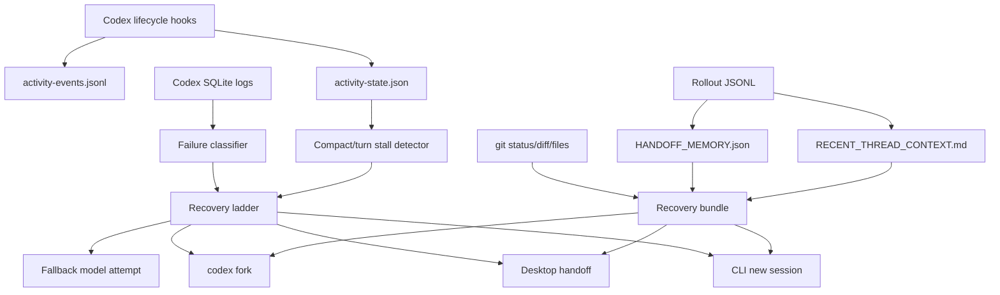

# Relay Baton Architecture

Relay Baton is a local recovery layer for Codex Desktop and Codex CLI. Its core job is to preserve the latest true task state and choose the least-lossy continuation path when a long-running session becomes unhealthy.

## Flow

## Evidence Priority

1. `HANDOFF_MEMORY.json`
2. `RECENT_THREAD_CONTEXT.md`
3. Git status, diff, and selected current files
4. Older project documents
5. Old thread title

This order is intentional. Stuck sessions often have stale titles or early plans that were superseded later in the conversation.

## Recovery Ladder

1. Try fallback-model recovery for model-specific compaction failures.
2. Try fallback-model recovery one more time for the same source thread.
3. Prefer `codex fork` because it keeps the original conversation history closest to intact.
4. Use Desktop handoff only when visible recovery is requested or configured.
5. Use a new CLI session when fork/Desktop are unavailable.

Every automatic action is bounded by per-thread cooldown, recovery count, and duplicate fork/Desktop handoff guards.

## Local State

Relay Baton stores its own state under `~/.codex/relay-baton/`:

- `activity-events.jsonl`
- `activity-state.json`
- `recovery-state.json`
- `bundles/`
- `logs/`
- `snapshots/`

It reads Codex state from local Codex files and does not edit `~/.codex/config.toml`.

## Audit Gate

`relay-baton audit <bundle>` validates `HANDOFF_MEMORY.json` and then scores the handoff quality. Invalid schema or blocked memory exits non-zero, which lets the command work as a release or CI gate for generated bundles.
